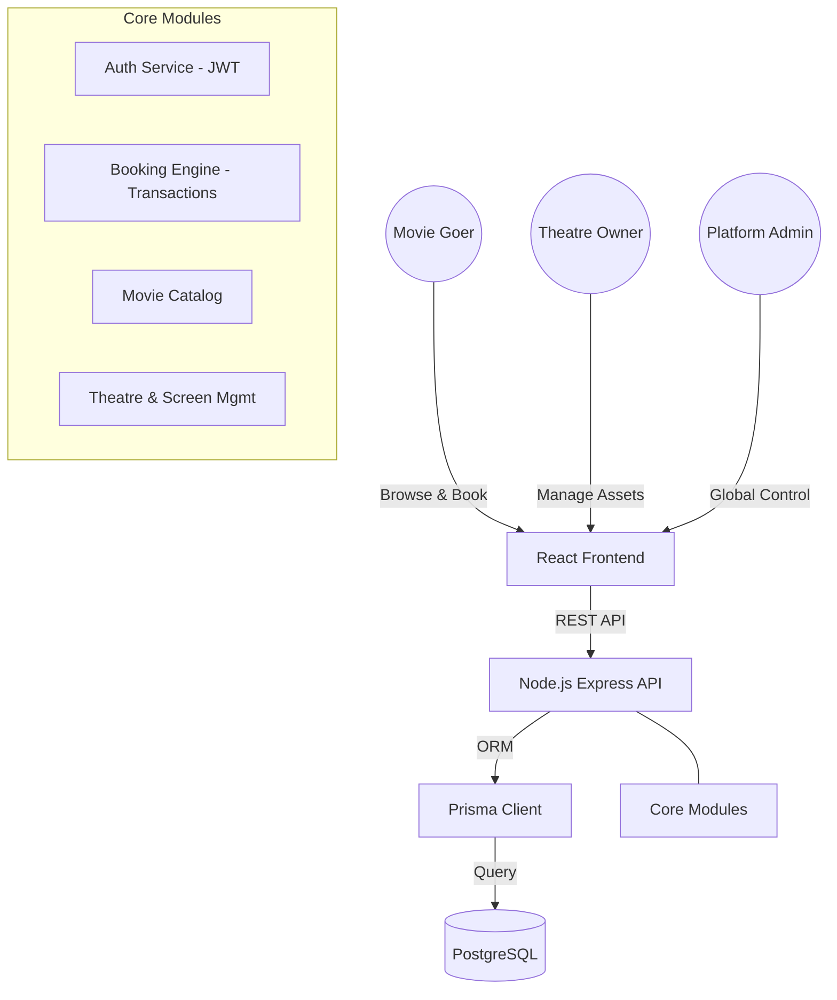

# 🎟️ Buy Pass: Premium Cinema Ticketing Platform

[](https://www.typescriptlang.org/)
[](https://reactjs.org/)
[](https://nodejs.org/)
[](https://www.postgresql.org/)
[](https://www.prisma.io/)

**Buy Pass** is a next-generation ticketing engine designed for high-end cinema experiences. It bridges the gap between beautiful cinematic discovery and robust, transaction-safe booking management.

---

## 🏗️ System Architecture

The platform is built on a split-portal architecture, separating the **Entertainment Layer** (Users) from the **Management Layer** (Partners/Admins).



---

## 💎 Core Value Propositions

### ⚡ The Booking Engine
Built for high-concurrency seat selection. Our backend utilizes **Prisma Transactions** to ensure atomicity—meaning no two users can ever book the same seat at the same time, even if they click "Confirm" at the exact same millisecond.

### 🎭 Multi-Portal Experience
A unified platform with distinct visual identities:
- **Consumer View**: Vibrant, cinematic, and immersive.
- **Partner View**: Clean, professional, and data-driven for business operations.

### 🛡️ Role-Based Security (RBAC)
Granular access control ensuring that Theatre Owners only manage their properties, while Admins oversee the entire ecosystem, and Users enjoy a protected browsing experience.

---

## 📂 Project Structure

```bash
├── backend/                # Express API & Business Logic
│   ├── prisma/             # Schema definitions & Migrations
│   └── src/                
│       ├── controllers/    # Request handlers
│       ├── routes/         # API endpoint definitions
│       └── scripts/        # Database seeding utilities
├── frontend/               # React (Vite) Application
│   ├── src/
│   │   ├── components/     # Reusable UI elements
│   │   ├── context/        # Global state (Auth)
│   │   └── pages/          # Full-page views
└── docs/                   # System documentation
```

---

## 🛠️ Quick Start

### Backend Implementation
1. **Initialize Environment**: `cp .env.example .env` (Configure DB URL)
2. **Install & Sync**:
   ```bash
   npm install
   npx prisma migrate dev
   npx prisma db seed
   ```
3. **Launch**: `npm run dev`

### Frontend Implementation
1. **Install Dependencies**: `npm install`
2. **Launch Dev Server**: `npm run dev`

---

## 🗺️ Future Roadmap
- [x] **Asset Management**: Dynamic form builder for theatre screen layouts and comprehensive Theatre Management system.
- [ ] **Digital Passes**: QR code generation and mobile check-in system.
- [ ] **Financial Bridge**: Integration with Stripe/Razorpay for live payments.
- [ ] **Real-time Engine**: WebSocket integration for live seat occupancy updates.

---
*Architected with precision for the future of cinema.*
