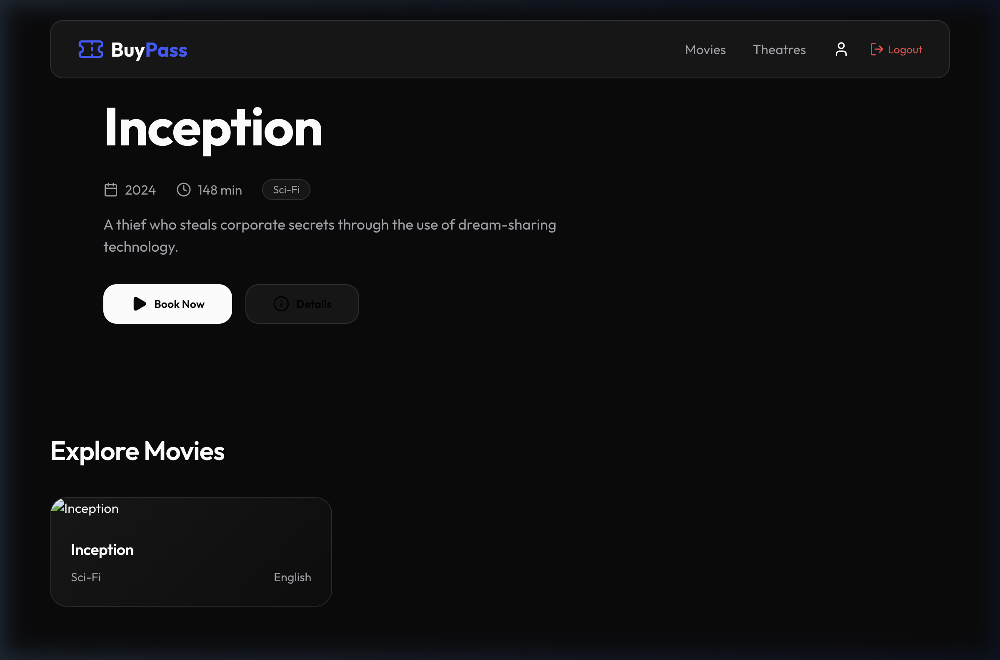
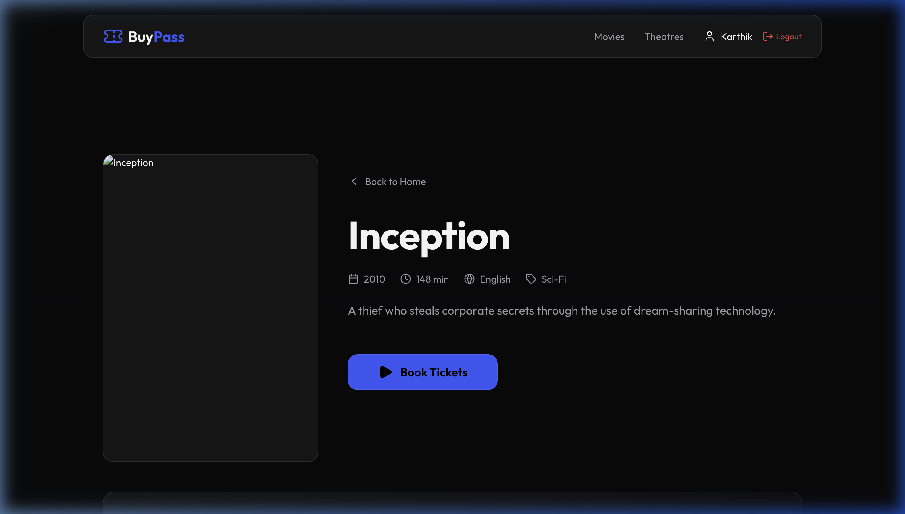
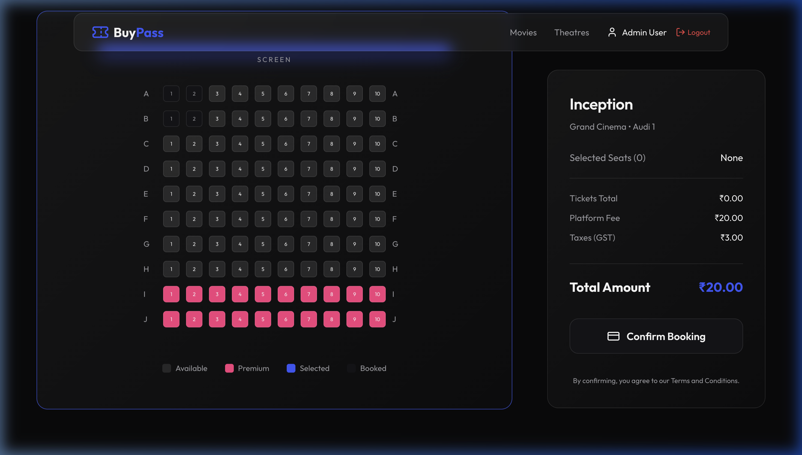
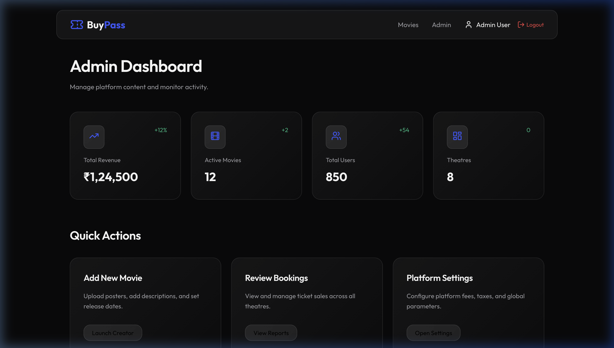
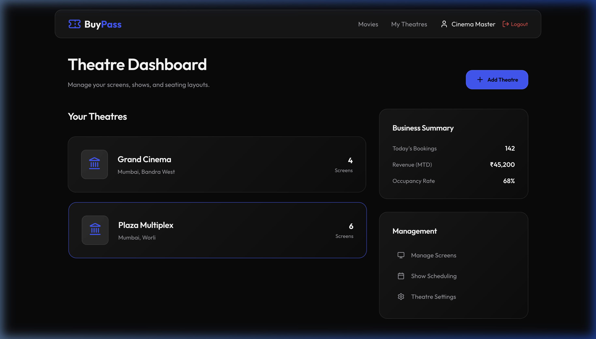

# 🎟️ Buy Pass

**Buy Pass** is a premium, cinematic movie ticketing and theatre management platform. Built with a modern tech stack, it offers a seamless experience for movie-goers and a powerful command center for theatre owners and platform administrators.



## 🚀 Key Features

### 🎬 For Movie Goers
- **Immersive Browsing**: High-fidelity UI with glassmorphism and dynamic movie posters.
- **Interactive Seat Selection**: Real-time 10x10 seat map with seat categories (Standard/Premium).
- **Instant Booking**: Prevents double-booking with backend transaction safety.
- **Dynamic Pricing**: Automatic calculation of ticket costs, platform fees, and GST.

### 🎭 For Theatre Partners
- **Dedicated Partner Portal**: A professional "Enterprise" login and registration experience.
- **Theatre Dashboard**: Manage screens, monitor occupancy rates, and track revenue.
- **Show Scheduling**: (In Progress) Tools to schedule movie showtimes across different screens.

### 🛡️ For Administrators
- **Platform Command Center**: Global overview of all users, theatres, and bookings.
- **Revenue Analytics**: Track performance across the entire platform.

## 🛠️ Tech Stack

- **Frontend**: React 19, TypeScript, Vite, Framer Motion, Lucide Icons.
- **Backend**: Node.js, Express, TypeScript.
- **Database**: PostgreSQL with Prisma ORM.
- **Authentication**: JWT (JSON Web Tokens) with Role-Based Access Control (RBAC).
- **Styling**: Vanilla CSS with a custom "Cinematic Dark" design system.

## 📸 Screenshots

| Feature | Screenshot |
|---------|------------|
| **Movie Details** |  |
| **Seat Map** |  |
| **Admin Dashboard** |  |
| **Owner Dashboard** |  |

## ⚙️ Setup & Installation

### 1. Prerequisites
- Node.js (v18+)
- PostgreSQL Database

### 2. Backend Setup
```bash
cd backend
npm install
# Configure your .env with DATABASE_URL and JWT_SECRET
npx prisma migrate dev
npm run dev
```

### 3. Frontend Setup
```bash
cd frontend
npm install
npm run dev
```

## 🗺️ Roadmap
- [ ] Implement Theatre & Screen creation forms.
- [ ] My Bookings page with digital QR code tickets.
- [ ] Integration with Payment Gateways (Stripe/Razorpay).
- [ ] Real-time push notifications for booking confirmations.

---
Built with ❤️ for a premium cinema experience.
